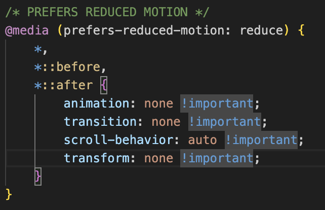
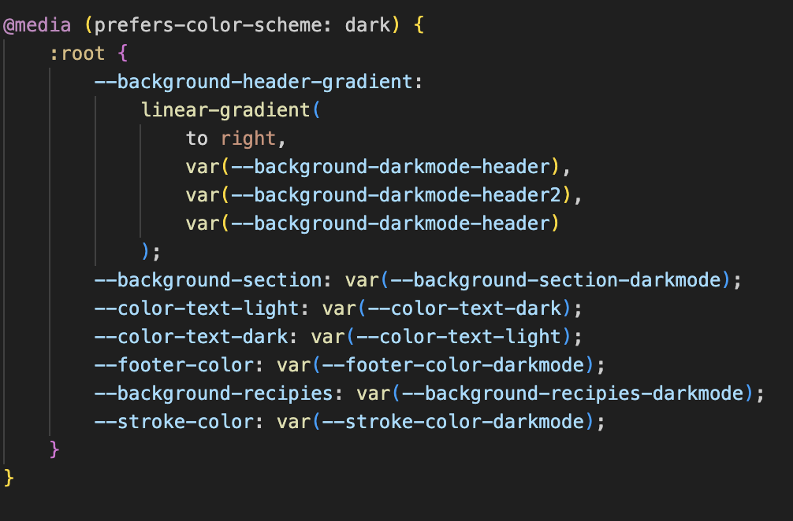
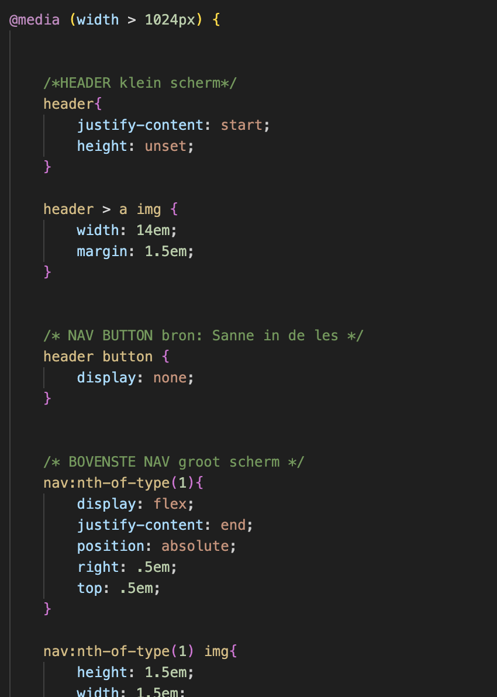

# Procesverslag
Markdown is een simpele manier om HTML te schrijven.  
Markdown cheat cheet: [Hulp bij het schrijven van Markdown](https://github.com/adam-p/markdown-here/wiki/Markdown-Cheatsheet).

Nb. De standaardstructuur en de spartaanse opmaak van de README.md zijn helemaal prima. Het gaat om de inhoud van je procesverslag. Besteedt de tijd voor pracht en praal aan je website.

Nb. Door *open* toe te voegen aan een *details* element kun je deze standaard open zetten. Fijn om dat steeds voor de relevante stuk(ken) te doen.

## Jij

  
uitwerken voor kick-off werkgroep

  ### Auteur:
  Daphne Jager

  #### Je startniveau:
  blauw

  #### Je focus:
  surface plane
 

## Je website

  
uitwerken voor kick-off werkgroep

  ### Je opdracht:
  (https://www.twix.com/)

  #### Screenshot(s) van de eerste pagina (small screen): 
  Home page 
  

  #### Screenshot(s) van de tweede pagina (small screen):
  sustainable page 
  
 

## Toegankelijkheidstest 1/2 (week 1)

  
uitwerken na test in 2e werkgroep

  ### Bevindingen
  Lijst met je bevindingen die in de test naar voren kwamen:
  - de website is redelijk toegankelijk voor de screenreader. Alleen zijn er op de home pagina een aantal
  foto's waarbij er geen beschrijving in zit. 
  Ook kunnen een paar knoppen een betere beschrijving krijgen
  dan alleen "see more" of "see details" of "DISCOVER"
  Ook gaat het in het headings menu van H4 naar H2 en dan weer terug naar H4. er is ook 
  geen H3, die wordt dus over geslagen.
  Er staat text in plaatjes, in plaats van text op plaatjes. hierdoor kan de screenreader
  de text op de foto niet lezen.
  
  
  

## Breakdownschets (week 1)

  
uitwerken na afloop 3e werkgroep

  ### de hele pagina: 
  

  ### dynamisch deel (bijv menu): 
  

  ### wellicht nog een dynamisch deel (bijv filter): 
  

## Voortgang 1 (week 2)

  
uitwerken voor 1e voortgang

  ### Stand van zaken
  hier dit ging goed & dit was lastig (neem ook screenshots op van delen van je website en code)

  ### Agenda voor meeting
  samen met je groepje opstellen

  | Daphne  
    Hoe moet ik werken met foto's met tekst (moet ik dat weg-editen?).
    En hoe ik mijn font moet dowloaden, want dit lukt niet.

  | Anouk
  Font inladen en carousel maken

  | Leon
    Hoe kan ik forms goed uitwerken, zoals een email input field
    Navigatie bar die zelf links heeft, met extra links er onder. Links kunnen alleen niet in links zitten. Hoe moet dit opgelost worden?
    Verder had ik 2 korte vraagjes over headers en of daar per se een tekst onder moet staan en hoe het ook alweer zat met SVG bestanden.

  | Tobias
  een bepaald hover effect in een <UL> maken

  ### Verslag van meeting
  hier na afloop snel de uitkomsten van de meeting vastleggen

  - github desktop downloaden
  - code is goed in orde verder
  - hamburger menu maken
  - ...

## Voortgang 2 (week 3)

  
uitwerken voor 2e voortgang

  ### Stand van zaken
  Had even error met github maar dat is weer opgelost:) hamburger menu werkt nu!

  ### Agenda voor meeting
  samen met je groepje opstellen

  | Daphne      
  hoe los ik het probleem met mijn carrousel op?
  hoe moet ik werken met bepaalde foto’s waar text op staat?

  | Anouk
  hoe kan ik mijn menu verbergen in een hamburger menu?
  hoe maak ik mijn carousel werkend 

  | Leon
    Hoe werk ik met een SVG Logo?
    Veel verschillende styling voor headers en andere elementen, hoe opstellen in style sheet zonder classes en heel veel uitzonderingen maken.

  | Tobias
  -

  ### Verslag van meeting
  hier na afloop snel de uitkomsten van de meeting vastleggen

  - Ik heb mijn caroussel kunnen oplossen
  - Ik heb veel kunnen leren over het opstellen van de kleuren

## Toegankelijkheidstest 2/2 (week 4)

  
uitwerken na test in 9e werkgroep

  ### Bevindingen
  grootste bevindingen:
  - ze hadden slechte of soms zelfs geen alt text. dat heb ik beter gedaan.
  - bepaalde text was niet leesbaar op foto's. ik heb dit verbeterd.
  - hun code had veel errors. mijne heeft er geen.
  - ik heb duidelijke selection colors en focus states toegevoegd.
  - de headings liepen niet op goede volgorde, en werden soms overgeslagen. ik heb dit op de goede manier gedaan.
  meer bevindingen te lesen op mijn checklist 
  
  
  
  
  
  
  

## Voortgang 3 (week 4)

  
uitwerken voor 3e voortgang

  ### Stand van zaken
 Mijn site ziet er eindelijk uit als een site. Ik moet wel nog mijn code fixen/netjes maken

  ### Agenda voor meeting
  samen met je groepje opstellen

  | Daphne    
  1. weer probleem met github
  2. moet ik bepaalde filmpjes toevoegen of is thumbnail genoeg
  3. hoe krijg ik de scrollbar weg en de puntjes omhoog  
  | Chiara
  1. mov exporteren van de site en in code zetten
  2. carrousel (met mov's)        
  | Leon
  1. Het maken van een hamburger menu. (Kan ik daar uitkomen door de les terug te kijken van java script? sinds ik die gemist heb)
  2. Feedback op goed responsive maken van de website.   
  | Tobias
  1. Carousel verbeteren
  2. hamburger menu is wederom gebroken.    
  | Anouk
  1. Hoe ik mijn lege <a> tags een transitie kan geven
  2. En ook hoe ik een carousel met filmpjes maak    

  ### Verslag van meeting
  hier na afloop snel de uitkomsten van de meeting vastleggen

  - Javascript gebruiken voor de knoppen carousel
  - hele carousel een height geven ipv de foto's. 
  - ook op de hele carousel een object-fit gebruiken
  - ...

## Eindgesprek (week 5)

  
uitwerken voor eindgesprek

  ### Je uitkomst - karakteristiek screenshots:
  
  

  ### Dit ging goed/Heb ik geleerd: 
  Ik heb veel geleerd over css.
  ik heb zelfs een klein beetje geleerd om het leuk te vinden.
  Ik heb goed geexperimenteerd.
  Ik heb meer geleerd over mediaqueries

  
  
  

  ### Dit was lastig/Is niet gelukt:
  Javascript blijft lastig voor mij
  Ik moet beter worden in mijn code opruimen
  
  

## Bronnenlijst

  
continu bijhouden terwijl je werkt

  Nb. Wees specifiek ('css-tricks' als bron is bijv. niet specifiek genoeg). 
  Nb. ChatGpT en andere AI horen er ook bij.
  Nb. Vermeld de bronnen ook in je code.

  1. [a11y project, hide content](https://www.a11yproject.com/posts/how-to-hide-content/)
  2. [w3schools, tabellen](https://www.w3schools.com/)
  3. [chatgpt] Prompt: welke filter waarden moet ik gebruiken om de image de kleur #E62B1E te geven 
  4. [oefenopdracht carousel]
  5. [oefenopdracht hamburgermenu]
  6. [oefenopdracht fontface]
  7. [SANNE]
  8. [W3schools, skip link maken] (https://www.w3schools.com/accessibility/accessibility_skip_links.php)
  9. [Selection colors] (https://developer.mozilla.org/en-US/docs/Web/CSS/Reference/Selectors/::selection)
  10. [webkit stroke] (https://developer.mozilla.org/en-US/docs/Web/CSS/Reference/Properties/-webkit-text-stroke)

